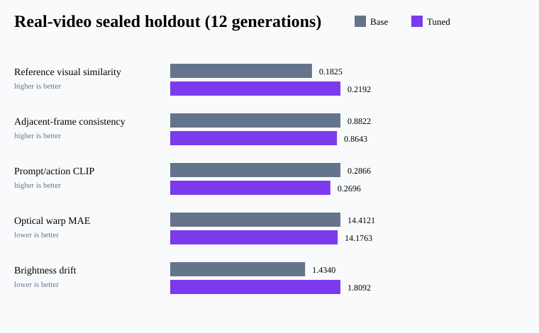

# Video Post-training Evaluation

[](https://github.com/hang154/video-posttraining-evaluation/actions/workflows/ci.yml)
[](https://github.com/hang154/video-posttraining-evaluation/releases)

Evaluation-first video adaptation work covering LTX-Video 13B,
HunyuanVideo-1.5, real-video manifests, sealed holdouts, and blinded review.

Hugging Face artifacts: [licensed-source manifest](https://huggingface.co/datasets/hang010412/video-commons-posttraining-manifest) · [evidence dashboard](https://huggingface.co/spaces/hang010412/posttraining-evidence-dashboard) · [portfolio collection](https://huggingface.co/collections/hang010412/h200-training-and-post-training-portfolio-2026-09-6aba3f860fbd297da8c7fd51)

> This repository is a sanitized public snapshot assembled from preserved run
> artifacts; original experiment timestamps are retained in the manifests.

## Real-video sealed holdout

| Proxy metric | Base | Tuned | Direction | Result |
|---|---:|---:|---|---|
| Reference visual similarity (DINO) | 0.182526 | 0.219183 | higher | improved |
| Adjacent-frame embedding consistency (DINO) | 0.882223 | 0.864330 | higher | regressed |
| Prompt/action similarity (CLIP) | 0.286574 | 0.269606 | higher | regressed |
| Action success | 1.000000 | 1.000000 | higher | unchanged |
| Optical warp MAE | 14.412127 | 14.176296 | lower | improved |
| Brightness drift | 1.433975 | 1.809216 | lower | regressed |



The historical result files retain their original keys for hash/audit
compatibility. Externally, `identity_dino_cosine` is described as **reference
visual similarity**, not identity verification: it is maximum similarity to a
reference-video embedding pool containing different subjects.
`temporal_dino_cosine` is an adjacent-frame consistency proxy and may reward
static output; it is not labelled general temporal quality.

## Synthetic controlled benchmark

### LTX-Video 13B

The 120-step LoRA improved the CLIP prompt/action proxy
(`0.2330 → 0.2566`) but regressed identity and temporal metrics. This is
published as a negative result rather than a cherry-picked demo.

### HunyuanVideo-1.5

A bounded four-step LoRA endpoint improved all five automated proxy metrics in
the preserved 50-prompt evaluation, including optical-flow warp MAE
(`15.0097 → 12.5380`). It remains a proxy result on synthetic character data.

## Real-video extension

The scene-level dataset split contains 16 train, 4 validation, and 4 sealed
holdout records. Media hashes do not cross split boundaries. Public manifests
preserve source URL, license, and hash metadata; source media is not
redistributed here.

Human review is **pending**. Blank blinded reviewer sheets and the review
protocol are included, but no preference rate is claimed.

## Validate

```bash
python scripts/validate_public_evidence.py
python scripts/plot_results.py
python -m py_compile scripts/*.py evaluation/*.py
```

## Limits

Automated embeddings and optical-flow proxies do not replace independent
human review. Dataset size and adaptation budgets are deliberately disclosed.
